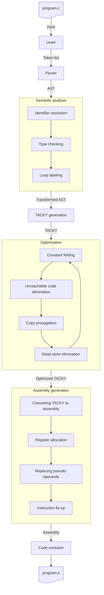

# Writing a C Compiler

This repo contains a Python implementation of a C compiler following [Writing a C Compiler by Nora Sandler](https://nostarch.com/writing-c-compiler). The final compiler is located in the X folder. It is ~Y lines of code.

[Eventually, describe the optimizations it makes and maybe some benchmarks and limitations.]

## File Structure

TBA

## Compiler Architecture



## Limitations

- Can only compile the simplest programs (just returns a single number)

## Usage

```text
usage: main.py [-h] [--stage {lex,parse,tacky,codegen,compile}] file

Compiler with stage selection

positional arguments:
  file                  Input file to process

options:
  -h, --help            show this help message and exit
  --stage {lex,parse,codegen,compile}
                        Select the compiler stage to run (default: compile)
```
